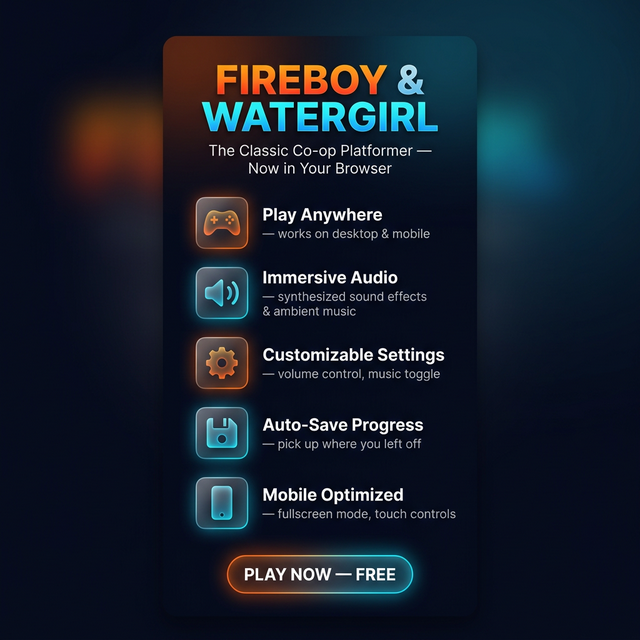

# 🔥💧 Fireboy & Watergirl — Web Edition


**🎮 [Play Now → luoxiaobin.github.io/fireboy_watergirl_web](https://luoxiaobin.github.io/fireboy_watergirl_web/)**

The classic Fireboy & Watergirl co-op platformer, completely modernized as a responsive web application built with TypeScript, React, and HTML5 Canvas.

<p align="center">
  
</p>

---

## ✨ Features

| Feature | Description |
|---------|-------------|
| 🎮 **Dual Character Control** | Play as Firegirl (Arrow Keys) or Fireboy (WASD) — switch between characters with one click |
| 🌐 **Play Anywhere** | Works on desktop browsers and mobile phones |
| 📱 **Mobile Optimized** | Touch controls, fullscreen mode, landscape orientation lock, iPhone notch handling |
| 🔊 **Immersive Audio** | Procedurally synthesized sound effects (jump, land, win, lose) — no external audio files needed |
| 🎵 **Background Music** | Ambient procedural drone using detuned oscillators with LFO modulation |
| ⚙️ **Settings Panel** | Volume slider, SFX toggle, music toggle — all preferences saved to localStorage |
| 💾 **Auto-Save Progress** | Your level progress is saved automatically — pick up where you left off |
| ✨ **Particle Effects** | Dust particles on jump & land for added visual polish |
| 🎨 **Premium UI** | Glassmorphic dark-mode design with smooth CSS transitions and loading animations |
| 🔄 **CI/CD** | GitHub Actions for automated builds & linting, deployed to GitHub Pages |

## 🛠️ Tech Stack

- **Frontend**: React 18 + TypeScript
- **Build Tool**: Vite
- **Canvas**: HTML5 Canvas for game rendering
- **Audio**: Web Audio API (`AudioContext`) for procedural sound synthesis
- **Styling**: Vanilla CSS with glassmorphism, gradients, and micro-animations
- **Hosting**: GitHub Pages via `gh-pages`
- **CI**: GitHub Actions (Node 18.x & 20.x)

## 🚀 Getting Started

```bash
# Clone the repo
git clone https://github.com/luoxiaobin/fireboy_watergirl_web.git
cd fireboy_watergirl_web/webapp

# Install dependencies
npm install

# Start the dev server
npm run dev
```

## 📁 Project Structure

```
fireboy_watergirl_web/
├── .github/workflows/ci.yml    # GitHub Actions CI
├── promo/                      # Promotional materials
│   ├── infographic.png         # Feature infographic
│   ├── intro_demo.webp         # Gameplay demo video
│   └── gameplay_screenshot.png # In-game screenshot
└── webapp/                     # Web application
    ├── src/
    │   ├── game/               # Game engine, physics, audio
    │   │   ├── GameEngine.ts   # Core physics & collision engine
    │   │   ├── AudioEngine.ts  # Procedural audio synthesis
    │   │   ├── ParticleSystem.ts # Particle effects
    │   │   ├── Jumper.ts       # Character class
    │   │   ├── LevelLoader.ts  # Level file parser
    │   │   └── constants.ts    # Game constants
    │   ├── hooks/              # React hooks
    │   │   ├── useGameAssets.ts # Asset loading
    │   │   ├── useGameControls.ts # Keyboard & touch input
    │   │   ├── useGameLoop.ts  # Fixed-step game loop
    │   │   └── useFullscreen.ts # Fullscreen & orientation
    │   ├── App.tsx             # Main application component
    │   └── index.css           # Global styles & design system
    └── public/                 # Static assets (sprites, levels)
```

## 🎬 Promotional Materials

Promotional assets are available in the [`promo/`](./promo) directory:

- **Infographic** (`infographic.png`) — Social media–ready vertical graphic
- **Demo Video** (`intro_demo.webp`) — Recorded gameplay walkthrough
- **Screenshot** (`gameplay_screenshot.png`) — In-game action shot

## 📜 History

This project originated as a Java Swing application for an ICS3U6 final project. It has since been completely rebuilt as a modern web application with responsive design, procedural audio, and mobile support.

## 📝 License

This project is for educational purposes.
